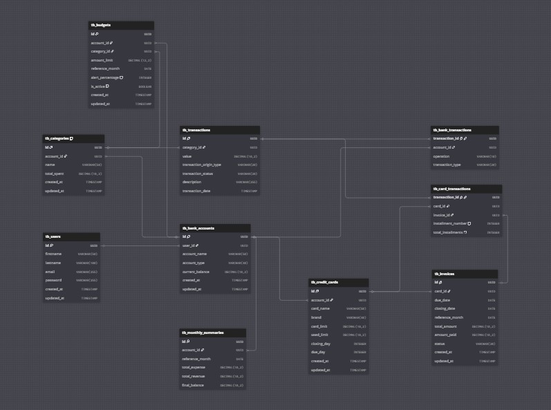

# Finly Finance | Plataforma de Gestão de Fluxo de Caixa

Finly Finance é uma plataforma de controle financeiro pessoal e profissional desenvolvida para otimizar a gestão do fluxo de caixa de forma prática e eficiente. A solução garante integridade e confiabilidade dos dados por meio de validações, padronização e controle de concorrência, permitindo rastreabilidade completa das transações, categorização estruturada e geração de relatórios analíticos para suporte à tomada de decisão.

Iniciei este projeto pensando em uma aplicação onde uma pessoa ou empresa, possa ter o controle de entrada e saída no fluxo de caixa, além de ser uma base de aprendizado e experiência de desenvolvimento de uma plataforma financeira, no qual novas funcionalidades, padrões arquiteturais e estratégias de modelagem serão incorporados gradualmente, acompanhando a evolução do sistema.

## Tecnologias Utilizadas

## Modelagem do Banco de Dados
